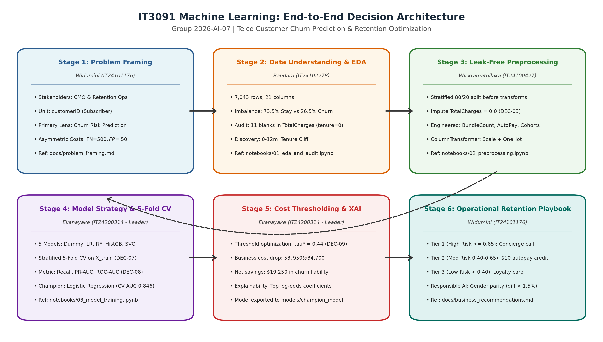
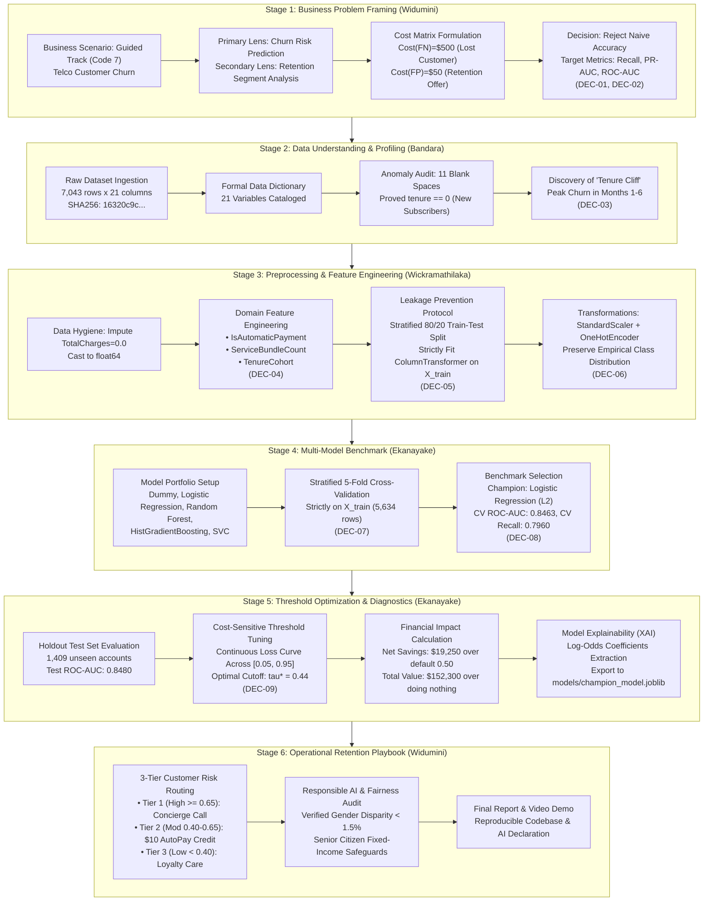

# End-to-End Machine Learning Workflow Diagram

**Module:** IT3091 Machine Learning Project  
**Group ID:** 2026-AI-07  
**Lead Author:** D G N S Widumini (IT24101176) & U P M U I Ekanayake (IT24200314)  
**Rubric Criterion:** Workflow diagram and decision log (10 Marks)  
**Fink Alignment:** Integration; Learning How to Learn  

---

## 1. Visual Workflow Diagram

---

## 2. Interactive Architecture Pipeline (Mermaid)

---

## 3. Workflow Decision Traceability Matrix

| Workflow Stage | Operational Owner | Core Deliverable Artifact | Architectural Decision Log Reference | Rubric Alignment |
| :--- | :--- | :--- | :--- | :--- |
| **1. Problem Framing** | D G N S Widumini | `docs/problem_framing.md` | **DEC-01** (Guided Track), **DEC-02** (Metric Choice) | Problem Framing (5m) |
| **2. Data Understanding** | E J M H D Bandara | `docs/data_dictionary.md`, `notebooks/01_eda_and_audit.ipynb` | **DEC-03** (Imputation of 11 blank records) | Data Understanding & EDA (10m) |
| **3. Preprocessing** | H A Wickramathilaka | `src/preprocessing.py`, `notebooks/02_preprocessing.ipynb` | **DEC-04** (Features), **DEC-05** (Leakage), **DEC-06** (Weights) | Preprocessing Decisions (15m) |
| **4. Modeling Strategy** | U P M U I Ekanayake | `src/train_and_evaluate.py`, `notebooks/03_model_training.ipynb` | **DEC-07** (5-Fold CV), **DEC-08** (Champion Selection) | Model Strategy (20m) |
| **5. Diagnostics & Tuning** | U P M U I Ekanayake | `reports/figures/08_threshold_cost_curve.png`, `models/` | **DEC-09** (Cost-Optimal Cutoff $\tau^* = 0.44$) | Evaluation & Judgement (20m) |
| **6. Business Action** | D G N S Widumini | `docs/business_recommendations.md`, `docs/final_report.md` | Master Final Report & Responsible AI Audit | Recommendations & Ethics (10m) |
